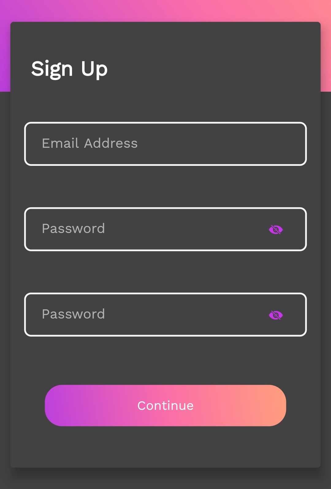
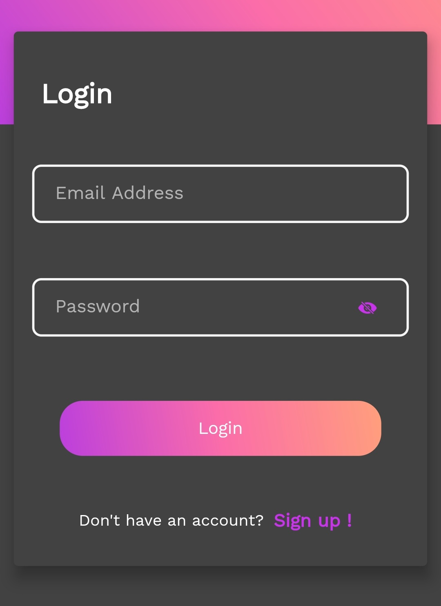
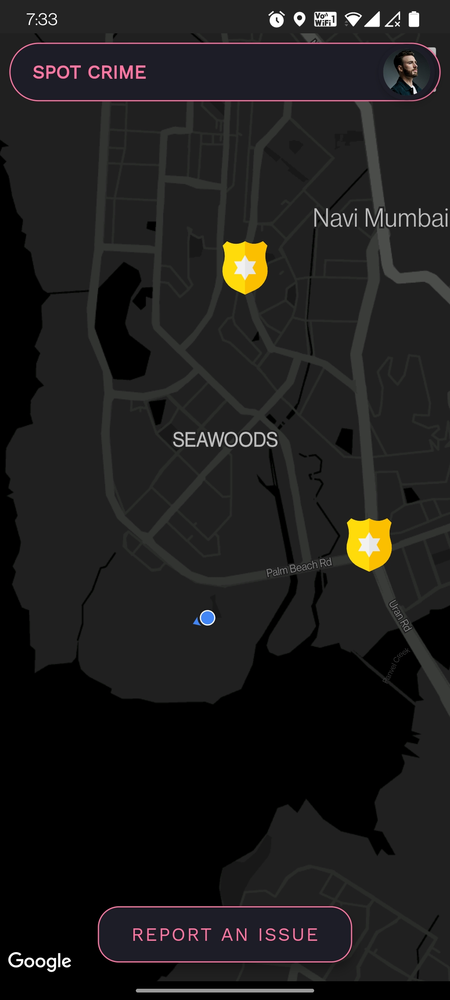
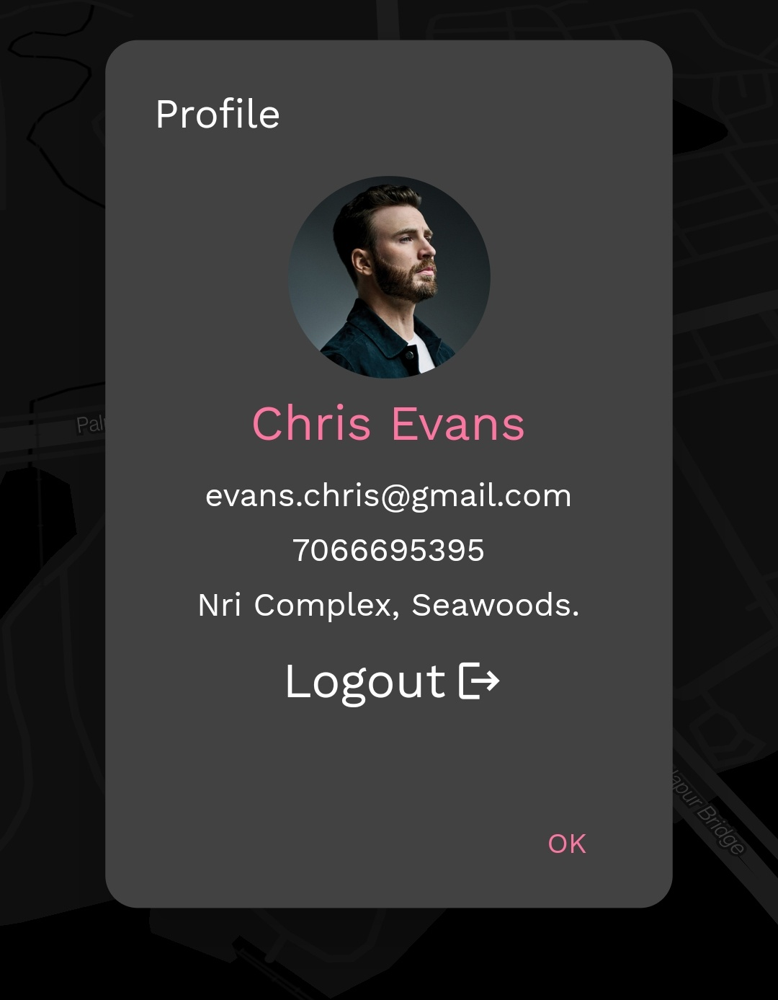
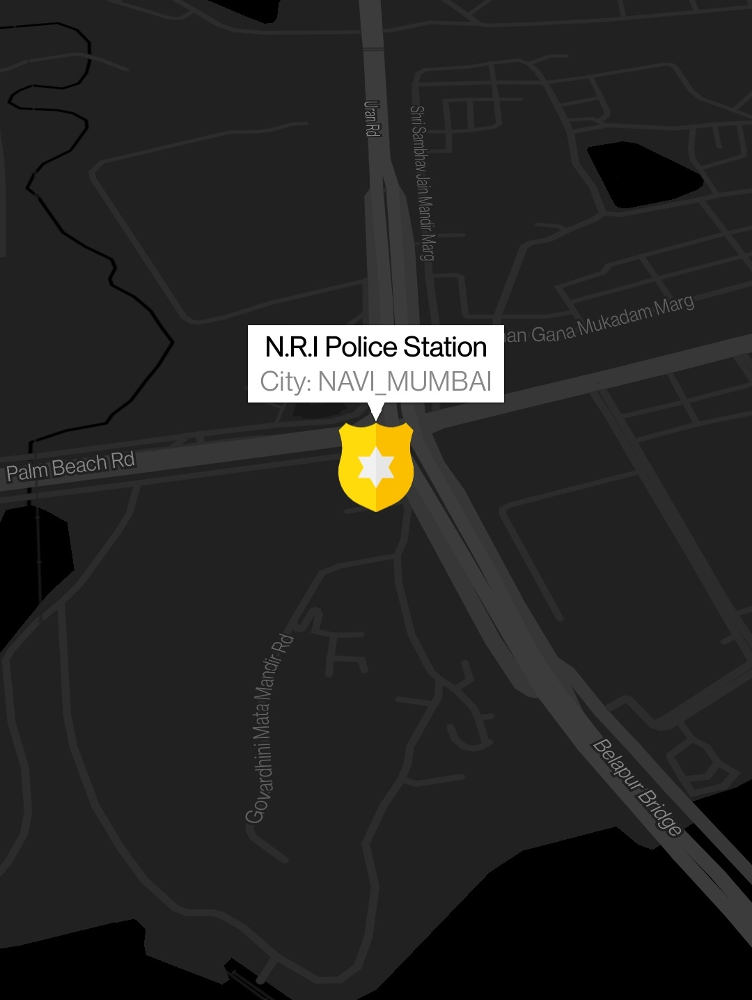
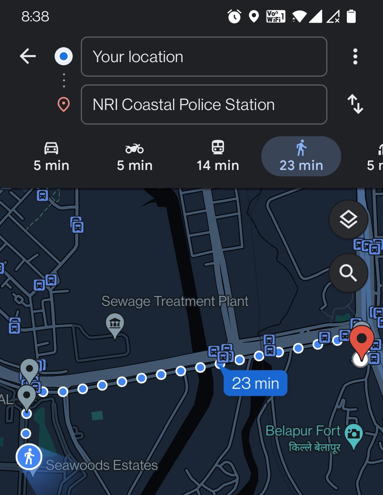
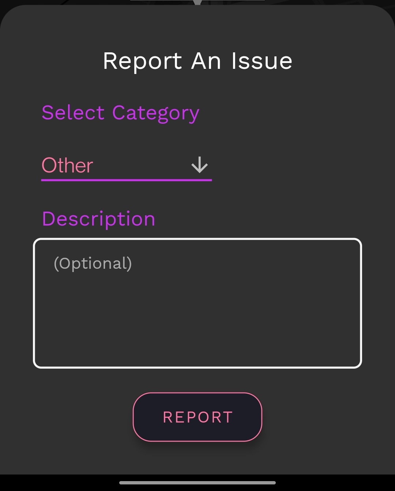

# LawPlus
<h3>CrimeTracking App</h3>

## Description

SpotCrime mobile application is a handy, user-friendly and well designed
safety android application which will help you to get connected with
law enforcement officials in no time.

## Installation

<a href="https://firebasestorage.googleapis.com/v0/b/crime-mapping-7610d.appspot.com/o/Apk%2FLawPlus.apk?alt=media&token=5bb5a8dc-f3be-4012-af35-7c5cce614095" >Download For Android</a> 

<h4>Signup Form</h4>
To validate the user and minimise duplicate and spam reports, registration is necessary at the start. Registration consists of filling up two forms. You have to enter an unregistered email and strong password in the first form. Personal credentials need to be filled in the second form.  

<h4>Login Form</h4>
After registering, you will be asked to go through the login process. This process consists of validation of your entered email address and your SpotCrime password.  

<h4>Home Screen</h4>
After you go through the login procedure the main screen of the application, that is,the home page is what you would be seeing.  

<h4>Your Profile</h4>
After registering, you will be asked to go through the login process. This process consists of validation of your entered email address and your SpotCrime password.  

<h4>Police Station Marker</h4>
The home page consists of a map in the background showing your exact current location as well as the police station (police badge icon) nearest to you. As soon as you tap on any of the police station icons, you’ll see the significant dataset about the respective station in the form of a pop-up.  

<h4>Heat Maps</h4>
Another type of map is featured in the middle of the screen, which shows the crime reports in a dynamic heatmap. These reflect the intensity of the reports, with deeper colours representing more reports generated from the region. These will give information on an area level.  

<h4>Navigation</h4>
By clicking the icon, a route viewer button will appear at the bottom right of the screen which when pressed will display the shortest and fastest path from your location to the nearest police station.  

<h4>Report An Issue</h4>
A menu will appear consisting of two input sections, one of them would be a dropdown consisting of the possible crime category (press ‘other’ if none of them falls under your situation). The second section is optional to be filled which asks for a short description about the scenario (recommended to be filled if you have chosen ‘other’ as your crime category). As soon as you press the report button, your complaint will reach the respective officials within a span of milliseconds and contact shall be made with you.  

<h4>Website</h4>
Only whitelisted individuals and law enforcement agencies have access to this cutting-edge website,
which is used to manage the huge intake of information. 
Website: https://lawplus.live/
<h4>Contributors</h4>
- App Developer: <a href="https://github.com/Darshan120501" >Darshan Rao</a> 
- Graphic Designer: <a href="https://github.com/bapuz">Anuj Patil</a> 
- Web Developer: <a href="https://github.com/Kaustubh0204" >Kaustubh Utturwar</a> 
